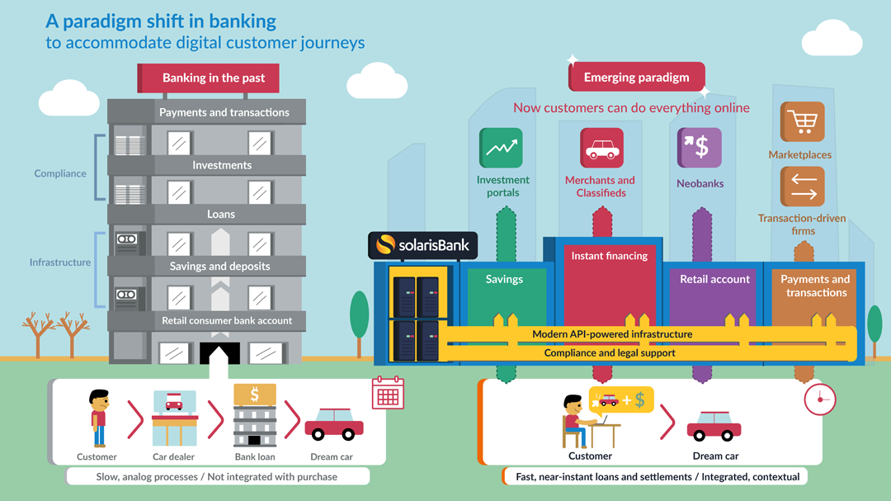
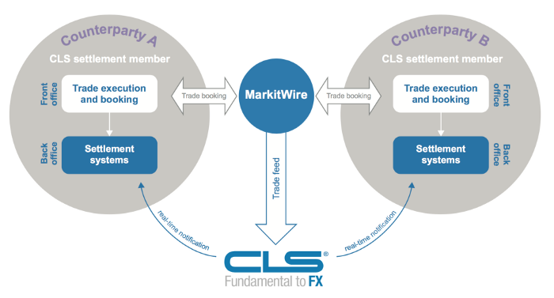

This article is 1st of the “Fin-Tech Start-Ups & The Established Financial / Banking Institutions “ Article Series.

In this Series, I will briefly discuss the ‘Current FinTech Start-Up Space’ and ‘different Distributed Ledger based Financial / Banking Solutions’ currently under development by Different Consortiums formed by different Banking / Payment / Investment Institutions .

                            The shifting Banking Landscape

This article is structured as below :-
1. **How Fin-Tech Start-Ups are impacting the Established Banking / Financing Systems?**
2. **Fin-Tech’s Impact on the Customer Segments**
3. **Overview of Blockchain driven Crypto-currencies & Platforms**
   * **A brief look at the past decade**
   * **Case Study:** Libra by FaceBook
   * **Case Study:** CLSNet, under development by Consortium formed by Institutional banks.

## 1. How Fin-Tech Start-Ups are impacting the Established Banking / Financing Systems?

Individual Emerging Companies / Start-Ups in the Financing / Banking space are not disrupting all the services of the Established Banking systems at once.

Rather, what is happening is that each individual start-up is focusing on a single specific vertical of the Banking revenue chain which has now started exerting profit-margin pressure on the established Institutions, which is further fuelled by Start-Ups’s use of efficient technical systems now available because of the Distributed Ledger Technology driven Architectures, or by incorporating more intuitive customer interaction experiences and systems by incorporating AI with design.

But the thing is, a group of disruptors which when act together, are like a school of piranhas that are inflicting many wounds over their victims. As each of these emerging companies / start-ups are aiming on a different vertical, it has started to unbundle and show its effect on the Single Monolithic Banking Institutions.

Unbundling has also allowed customers, particularly the age group below 35, to have a choice of providers for each specific Financing / Banking use-case.

Institutional Banks, which historically catered to each of these Financing / Monetary needs, are now facing competition over all these individual segments, because of which most of the Banks have started integrating :-

* **Technical Innovations** — A.I for automation, more engaging user-experience, analytical services, and more intuitive design.
* **Distributed Ledger Technology (DLT)** — to improve their services and compete with these upcoming Financing / Banking Solutions, by forming Consortiums.

These on-going Improvements happening within the Financing / Banking sector have started to show its effect, as all Major Banking Institutions are now working on incorporating Technical Advances with the existing systems.

## 2. Fin-Tech’s Impact on the Customer Segments
Customers have started moving away from a single bank that provides all services that serve the majority of their financial needs and are hand picking specialised services from various providers with specialised services. (usually startups)

With a smart phone and a new technology, the barriers to entry have been lowered for newcomers. Start-ups are attracting funds from venture capitalists and reinventing finance by -

1. providing banking without fees
2. mobile payments and money transfer with low fees
3. wealth management using robo-advisors with a fraction of the fees
4. business loans with shorter duration
5. lower fees and interest
6. merchant and insurance services with better user experience
7. free software to ensure timely payroll management.

In summary, these emerging companies have allowed increased access to data and information; reduced friction for transactions, and lowered the cost and fees for the consumers.

## 3. Overview of Blockchain driven Crypto-currencies & Platforms

### A brief look at the past decade

Bitcoin and other cryptocurrencies entered the scene with a quite provocative and bold attitude, blaming the current financial system for the 2008 crisis and accused them of running a faulty business-model that allowed them to earn big money without much effort. The threat posed by them to remove middle-men (i.e Banking Institutions) was credible.

The banks reacted quite aggressively to the cryptocurrency movement, associating Bitcoin with the use of drugs, the illegal purchase of weapons and the funding of terrorism. This provoked a controversy during which both sides contested the legitimacy of the other and justified their own right to exist.

The scale of the progress of digital money, i.e cryptocurrencies can be judged from the fact that there is now a chrome extension called Moon, which allows you to pay on amazon using Bitcoin. Through Moon’s browser extension, shoppers can connect their cryptocurrency wallet and use it at the checkout to pay for goods. The exchange from cryptocurrency to fiat money is handled by a financial institution and the merchant is paid with fiat money. Moon is planning to expand this service to other online platforms such as eBay, Etsy, Dominoes pay and other leading online shopping portals.

Sensing this sudden competition backed by technological innovation (i.e blockchain) brought about by cryptocurrencies, many Global banks have started integrating the technology underlying cryptocurrencies, i.e blockchain or Distributed Ledger Technology, in their own systems.

### 1. Case Study: Libra by FaceBook

Facebook introducing Libra, positioning it as digital currency which can reach scale very quickly has added fuel to the already ongoing debate related to cryptocurrencies. Development of a private digital currency poses a number of risks related to the stability of the banking and financing systems, while also leading to oversight.

Imagine this, your Whatsapp and Facebook messenger (both a part of Facebook) starts providing money transfer services where the inherent transaction processing is built upon the Libra blockchain eco-system, enabling almost instant transfers across the World. Now what happens internally here is that the currency from Country A is first tokenized into libra coins and it stays tokenized until the destinant party transfers the amount from his Facebook / Whatsapp wallet into his own bank account.

But what if he doesn’t. What if the money transferred is used to make payments to further connected parties leading to the creation of self-sufficient globally distributed payment supply chains. What is even more worrying is that this money distribution supply chain is free from any kind of regulation from any of the Governments or regulatory bodies. This leads to the possibility of creation of supply chains distributed across continents where the amount of currency going out / coming in through these chains is not regulated by the government and the state institutions may not even be aware of the amount being transferred unless the required information is inherently provided by facebook. The scale at which it can happen because of the user-base facebook already boasts off can add more volatility to the currencies and the forex market.

In India, we have Paytm which provides somewhat similar services, though it is not developed over blockchain and neither does it support international transfers. In terms of regulatory compliance, there are KYC checks in place which inherently link your Paytm wallet to your PAN / AADHAR number, ensuring the money is accounted for and is under constant regulatory checks.

But in case of Facebook, the Libra project talks about the possibility of a digital currency backed by financial assets (basket of currencies, ETF’s, Treasury bonds), free of any state borders and providing room to support plethora of use-cases imaginable. A particular state Government may enforce checks to allow using Libra service but to ensure that such checks are enforced globally is difficult.

I believe that the use-case that libra provides is worth pursuing but it should rather be implemented within the existing Banking and financial frameworks to ensure regulatory compliance.

### 2. Case Study: CLSNet, under development by Consortium formed by Institutional banks.

Maybe CLSNET, which is a bank owned currency trading utility which works for 120 fiat currencies, now running live in production environment and used by over 71 largest banks active in the forex market, somewhat provides the same functionality through its “payment versus payment” service and by reducing settlement risk, but it will take it years to provide same kind of instant transfer service with minimal transaction charges that libra promises of.

The vision that libra wants to execute looks exiting from a user perspective but we do not live in a wishy-washy world. There are regulatory realities it needs to fulfil and state government specific rules it needs to follow. A shift within the established banking systems has already started but to make the legacy infrastructure completely redundant takes time. For eq, the CLS main settlement system handles the volume of around $12.8 trillion in forex market, and while the figures for the CLSNET are not out yet, it will take it years to even reach somewhat near to the volumes handled by the main settlement system.

Beside Libra by Facebook, Gram by Telegram (Telegram Open Network (TON) blockchain ) and Units by Walmart are some other digital currency projects being worked upon by large private companies with different business and political approaches.

Telegram has recently made it public that it will not integrate the TON wallet with its telegram messaging App. Although this is what was previously suggested in the backdrop of which it managed to raise $1.7 billion dollars through its ICO involving sale of Gram tokens. The SEC has now deemed the ICO as a sale of unregistered securities, and the telegram is trying hard to navigate its legal challenges in the court. You can go through the public notice about the TON Blockchain here.

Digital currency projects which are currently under development by tech corporations completely contradict the original ambition behind the early development of cryptocurrencies (like Bitcoin), which were driven by an aspiration for decentralising control from central banks and states. Digital currencies issued by large tech corporations could instead transform the nature of this technology by creating privately owned forms of money.

Whether the alternative financing systems being introduced by cryptocurrencies become part of the new normal remains to be seen. What is now evident is that the underlying technology behind cryptocurrencies, i.e the blockchain, is here to stay and will eventually change the way the current global banking and financial systems operate.

Here's the link to the next article <strong><a target="_blank" href="https://cryptowhaler.github.io/2020-07-09-Startups_Institutions2/" class="list-filter">FinTech Startups & The Established Financial / Banking Institutions : PART — II</a> </strong>