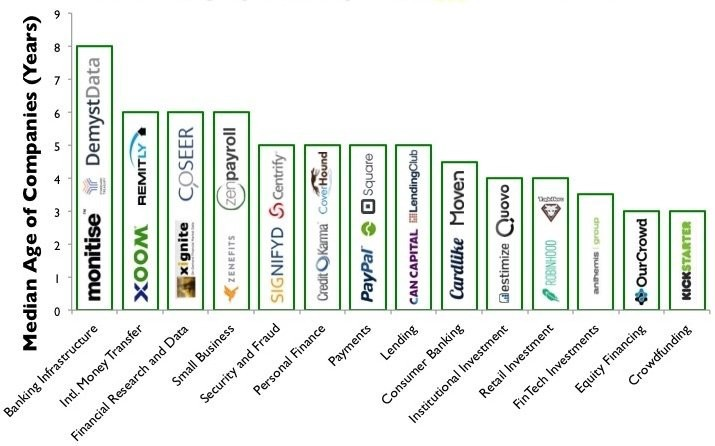
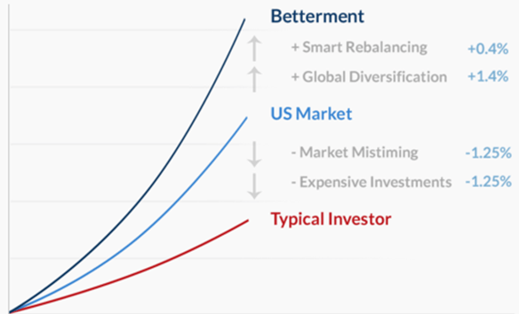
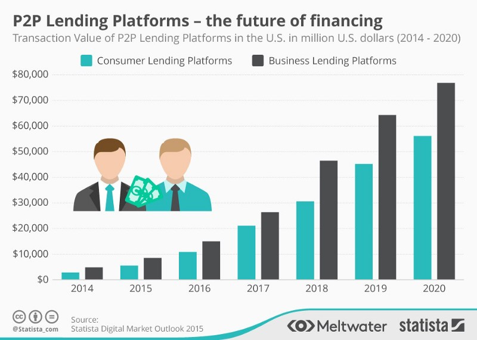
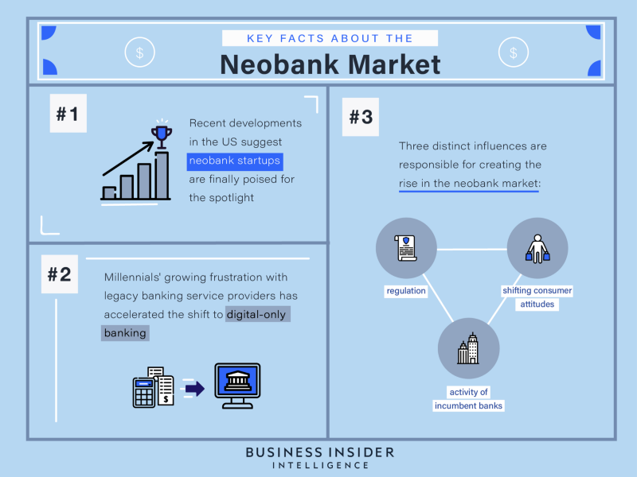
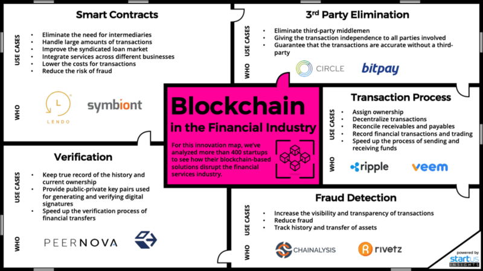
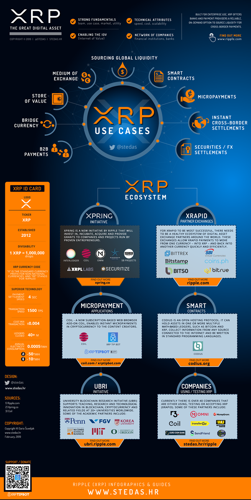
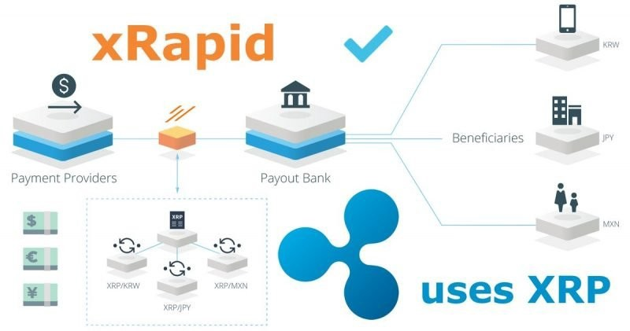

This article is 2nd of the "Fin-Tech Start-Ups & The Established [ Financial ] / [ Banking ] Institutions " Article Series. 

In the backdrop of the introduction provided in the previous article - <strong><a target="_blank" href="https://cryptowhaler.github.io/2020-07-17-FinTechSectorAnalysis1/" class="list-filter">FinTech Startups & The Established Financial / Banking Institutions : PART — I</a> </strong>
, here I will be discussing the current fin-tech market, briefly mentioning -

* Some of the successful Fin-Tech start-ups which are individually targeting different revenue streams of the currently established Banking systems.
* 2 of the Major Distributed Ledger Technology (DLT) {Blockchain} driven 'Financial Architectural' Development Environments - Ripple & Ethereum.

The infographic given below categorizes the start-ups based upon how they are disrupting different verticals of the banking / financing system.

This article is structured as below :-

1. **Start-ups disrupting the Wealth Management services of Banks ( Robo-Advisors )**
2. **Start-ups disrupting the Lending services of Banks ( P2P Lending )**
3. **Start-ups disrupting the Banking services of Banks (Neo Banking)**
   *  Plaid Case Study
   * DLT / Blockchain Case Study : Ripple
   * DLT / Blockchain Case Study : Ethereum

Some of the widely recognized fin-tech start-ups are briefly discussed here.

# Start-ups disrupting the Wealth Management services of Banks ( Robo-Advisors ):-
* **Wealthfront and Betterment** are 2 of the largest independent robo-advisors, and are leaders in the online, automated investing space. Both Wealthfront and Betterment create a portfolio from your risk tolerance and then put your money into an asset allocation of ETF's (exchange traded funds) or stocks that matches your tolerance. They then combine proven investment strategies with software with a goal to maximize your returns. Both are available online and as an IOS or Android App.

* Both services use a methodology based in Modern Portfolio Theory, which says that individual security selection is not as important as proper asset allocation. The investment's risk and return characteristics should be evaluated by how it affects the overall portfolio's risk and return.

* Using this methodology, both services ultimately aim to maximize the investment return for each client's particular tolerance for risk. Based on an initial questionnaire about your investment needs, financial background, and risk tolerance, they allocate your money among asset classes (e.g. stocks, bonds, real estate), then use algorithms to monitor and periodically rebalance your portfolio.

* Robo-advisors give you peace of mind when it comes to making investment decisions.

# Start-ups disrupting the Lending services of Banks ( P2P Lending ) :-

* Peer-to-peer lending platforms like **Prosper and Lending Club** are online platforms which directly match savers with borrowers who need personal and business loans. Similar to other two-sided markets, online lending marketplaces try to attract two different groups of users, borrowers and investors, by choosing an appropriate structure of fees that increases the size of network effects.
* Platforms collect some information about the applicant ( FICO score, debt-to-income ratio, credit report etc ), which is used to compute a proprietary credit score. Consumers are divided into several rating segments, which correspond to different fixed interest rates ranging from 5% to 30%.
* On the investor side, Investors are divided into two different populations: individuals and institutions. Prosper and Lending Club issue a series of unsecured Notes for each loan that are sold to the investors (individual or institutional), and recommend that each investor diversifies his/her portfolio by purchasing small amounts from different loans. Each investor is entitled to receive pro-rata principal and interest payments on the loan, net of a service charge paid to the platform.

# Start-ups disrupting the Banking services of Banks (Neo Banking) :-

* Digital banking apps like **Moven (online-only bank)** are disrupting the banking service by providing a personalised smart-banking experience, augmented with Artificial Intelligence (AI) and machine learning (ML). It is a digital financial manager which is designed around the mobile consumer, making banking easier and provides a range of financial behavioural analytics using AI.
* Moven is trying to evolve the basic day-to-day bank account, which was personified by an account book in the 70's, and now by a debit card. Moven is trying to move it to your smartphone. It is designed as a digital solution focussed around the customer, improving their control over their financial wellness by providing intelligent behavioural analytics.
* On Moven, personal payments can be made by email, text or Facebook. Store payments are encouraged by contactless technology like NFC (near-field communicator) built into your phone. As you pay, you can see your balance before and after a transaction, and it also gives you real-time feedback that helps you understand the impact of simple spending decisions.

## Plaid Case Study
One of the main driving forces behind the success of these FinTech companies has been the use of open application programming interfaces (APIs). Open APIs allow third-party access and development, thus resulting in crowd sourcing wisdom and talents.

Plaid, a Fin-tech company which provides a technology layer for financial services has been recently acquired by Visa in January 2020 for $5.3 billion. Plaid provides API for financial services as a technology layer in the Fin-tech space.

API Banking helps the banking sector in securely integrating with corporate clients through ERP system. With the help of API, banks provide instant payment and collection services to the consumers. API by banks is used for payment of salary to employee of an organization, vendor payments, Foreign Inward Remittances, cash collection, etc.
Plaid's software acts as a kind of plumbing, connecting apps to a new user's bank to quickly confirm him / her as an account holder, without any penny deposits or paperwork.

## Ripple Case Study
If we look at start-ups and financing platforms being powered by blockchain, Ripple provides one of the most interesting case studies.

Ripple enables banks, payment providers, digital asset exchanges and corporates to send money globally using blockchain technology. It is a -
*  Real-time gross settlement system : A specialist fund transfer system where the transfer of money / securities takes place from one bank to any other bank on a "real-time" basis, meaning that the payment transaction is not subjected to any waiting period, as transactions are settled as soon as they are processed. RTGS systems are typically used for high-value transactions that require immediate clearing.
* Currency exchange : The Ripple provides currency exchange service where the virtual currency of ripple, XRP, acts as a bridge between currencies. Hence, it makes it easy for any currency to be exchanged for another.
* Remittance network : Remittances are different from usual payments. Remittance usually implies money sent to family / friends usually across international borders, that is, money is sent without any commercial purpose. It is very similar to making payments as both involve transfer of money, but usually the regulations are different for remittances as compared to payments.

The success of Ripple can be judged from the fact that the US governmental agency, the Consumer Financial Protection Bureau (CFPB) recently described XRP as a reliable remittance method which makes the whole transacting process much faster and cheaper for companies that have a limit on conducting money wires each year.

Some of the developments which showcase Ripple's developments are listed below.
* Money transfer firm SendFriend, which utilizes Ripple's XRP payment solution, claims to help customers save up to 80% in remittance fees. SendFriend is now able to source liquidity on-demand and it cut transaction costs by up to 75%
* SBI has recently teamed up with Ripple by introducing SBI Remit, which powers instant remittances between Japan and Thailand. In collaboration with Siam Commercial Bank (SCB), SBI Remit is using RippleNet to power real-time remittance payments between Japan and Thailand
* SBI Remit's customers can use ATMs to instantly send money in JPY to a recipient's SCB savings account in Thailand and receive funds in THB within seconds. Before offering this service, recipients were required to retrieve cash through an agent. As of now, the monthly cumulative payment volume is over 10 Billion (JPY).
* MoneyGram, Ripple's partner recently announced its plans to expand its presence in the Indian Market. In 2019, MoneyGram secured a partnership with Ripple, where the on-demand liquidity (ODL) started using XRP (as a bridge between 2 fiats) to facilitate transactions, ensuring faster speed.
* MoneyGram will now power remittance services in more than 4,000 cities and 75,000 villages, thus allowing users to seamlessly send and receive money across the globe. The inward remittance volumes are expected to reach $3 bln annually.

Future looks bright for Ripple, and its founder Chris Larsen. But the most impactful Blockchain platform has no doubtedly been Ethereum. There have never been a case in the history of finance where just 1 technical upgrade will have as many implications as is in the case with the upcoming release of Ethereum 2.0.