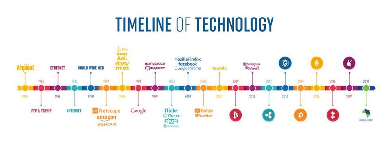

Around 1969, a military research program called ARPANET was launched by the Defence Advanced Research Projects Agency (DARPA) which promoted the sharing of super- computers amongst military researchers in the United States. ARPANET was the precursor of today's internet.

Fast forward to 1993, the first GUI browser, NCSA Mosaic, was released. In 1995 Netscape Browser was released, which marked the time when the internet started going mainstream.

The next iteration of the Web brought on the rise of corporate internet giants such as Google, Facebook and Amazon. In addition, e-Banking services started to become available, allowing electronic cross border payments.

Then in 2008, Bitcoin introduced a revolutionary technology and became the first digital currency, revolutionizing finance. Ethereum extended the concept by adding decentralized computing architecture to the blockchain, showcasing just one of the unlimited ways in which the blockchain architecture can be utilized.

One of the main reasons that Blockchain has generated so much interest is because it allows us to re-imagine how the internet works, allowing us to develop Applications with Architectures not possible before. The technology uses cryptography right down in its transport layer protocols, and the data is in moving state right from the start.

The user interface and the application layer of technologies are fun to demonstrate and easily gather attention. However, in blockchain much of the development or innovation is concentrated at the lower layers of the technology stack, shown in the Figure.

Possibilities provided by such an open-ended architectural design is one of the main reasons Blockchain is often referred to as WEB 3.0. Such distributed architectures allow us to integrate upcoming technologies like machine learning within the transport layers / consensus layers, allowing us to develop completely new kinds of applications, usually referred to as Dapps.

We will be introducing the Blockchain Technology Stack and will briefly describe different areas covered by each Layer of the stack.

Here, 
* **Application layer** refers to the Interface through which the user interacts with the Blockchain. It deals with User Interface design and Business Logic. 
* **Services layer** refers to the services provided to the application layer which enable its proper functioning and connection with the technology. 
* **Network and Protocol layer** defines the network participation requirement, base protocols, Virtual Machines and the method of consensus being used in the blockchain.
* **Infrastructure layer** refers to the storage, computing, network and mining services required by the blockchain. 

# Application layer 

Application layer will have the User Interfaces along-with Business-Logic communicating with the blockchain.

* **DAPPS:-** Dapp refers to the decentralized application communicating with the blockchain. Some dApps provide a desktop browser like user-Interface. Some of the commonly used Dapps include Metamask, a crypto wallet.

* **Application Hosting:-** Application hosting is a type of SaaS (software as a service) hosting solution that allows applications to be available from a remote cloud infrastructure and to be accessed by users globally through the internet.

The decentralized application needs this layer because this layer provides a lot of support to the users. The layer makes all the dApps easy to access and integrate with any devices.

# Services layer

Services layer refers to the services provided to the application layer which enable its proper functioning and connection with the technology. It basically goes into the technology layer, and usually covers data feeds, Off-chain computing, State channels, and side chains.

* **Data Feeds :-** It's a mechanism used for receiving updated data information from credible sources. It is used by nodes for updating their information accordingly.

* **Off-Chain computation :-** In Off-Chain computation, computing is done outside the blockchain application stack. It's comparatively less costly and time-saving than on- chain computation.

* **State channels :-** State Channels are a two-way pathway between two peers who want to communicate with each other through the means of transaction. Every user on the channel will have to sign their transactions with their private key to ensure they are fully authorized and coming from the real user. These channels come with a limited time-frame, which means they will disappear after a predetermined time-frame.

* **Oracles :-** Oracles are a form of data feeds used in the blockchain network to support smart contracts. They act as an agent, who finds out information about the real-world situation and carries those information to the smart contracts. The information can be anything - market evaluation, payments information, etc.

* **Smart Contracts :-** The smart contract is based on the agreement of the parties. The rules are set from before and after the execution of those rules, everyone will get their fair share of the money. It's all automated so there isn't any influence of higher authority.

* **Digital Identity :-** Digital identity is necessary as it gives you authorization where it's needed.

# Network and Protocol layer

The network and protocol layer defines the network participation requirement, base protocols, virtual machines and the method of consensus being used in the blockchain. Let's take a closer look at them.

* **Consensus Mechanisms (POW, POS, PO-AI):-** Blockchains use consensus algorithms to ensure that the nodes come to an agreement. A consensus problem is structured which needs to be solved to add new blocks to the blockchain. The Proof- Of-Work consensus mechanism which supports Bitcoin has been under criticism for its energy requirements. Bitcoin consumes an estimated 58.93 TWh per year, more than Switzerland which consumes 58.46 TWh per year. Some of the common consensus mechanisms are - Proof-Of-Work, Proof-Of-Stake, Delegated-Proof-Of- Stake.

The kind of consensus mechanism used depends upon the business requirements and the use-cases that the blockchain pertains to. We will be introducing a Proof-Of-A.I aka a Proof-Of- Learning consensus mechanism in the next section, when we talk about building an IDE where you can Train and deploy Portfolio-Trading strategies over the blockchain. The underlying innovation in the platform lies in the consensus mechanism being used, where the consensus mechanism will evaluate the models and execute them based on ranking, and the overall architecture is designed in such a manner which optimizes risk diversification while maximizing profits, while taking into account user preferences.

* **Side-Chains:-** Sidechain is a unique kind of emerging mechanism introduced to allow tokens or other assets to go from the mother blockchain to a separate blockchain and then back again. Developers can easily develop decentralized applications within the sidechain without influencing the main chain in any way. However, everyone on the network will be able to utilize the effectiveness of the apps.

* **Access Control (Permissioned / Permissionless) :-** This refers to the access restriction features, i.e. whether the blockchain will be permissioned or permissionless..

* **Virtual Machines :-** Virtual Machines are basically runtime environments for smart contracts so that users can benefit from the service. Blockchain as a decentralized computer concept has been validated by Ethereum. The mechanism by which the code which is chosen by the Virtual machine to be executed is governed by different protocols which can be chosen based on business and feature requirements of the blockchain. The virtual machines also make sure that the Denial-Of-Service kind of cyber-attacks cannot be done on the blockchain and everything keeps on running smoothly.
Ethereum Virtual Machine (EVM), Direct LLVM exposure, Web Assembly Virtual Machine (WASM) are some of the virtual machines being used by current blockchains. Many platforms use their own customized virtual machines

* **Transport Layers :-** Transport layer refers to a network and protocol suite used for decentralized data distribution. We will be briefly discussing 2 common types here.
    * RLPx :- RLPx is a network and protocol suite created to aid in general purpose transportation between two peers. It was designed for decentralized applications and is currently being used by Ethereum.
    * Roll Your Own:- This method enables a user to create their custom protocol to better adjust to their needs.

# Infrastructural layer

The lower infrastructure layer supports the development and operation of the applications at the top of the stack. Blockchain technology processes and commits data to storage differently from legacy approaches.

* **Distributed Computing:-** Distributed Computing is a concept where multiple computers work on a single problem to solve it. A single problem can get divided into many parts and then distributed across the network. So, for solving the problems, all the computers will act as one single entity. This will be achieved by connecting all the nodes by a lightweight software agent. This is the same process as mining cryptocurrencies or bitcoin. All the miners can work like a unit and solve the problem and then get rewarded after that.

* **Virtualization :-** Virtualization means to create a virtual resource such as desktop, server, OS, storage. Virtualization can transform traditional computing and make workloads more scalable than before. If virtualization can be implemented at hardware level, system level, and server level, then it can completely change the way we approach architectural designs. This technology can greatly reduce the cost of deployment, resources, operational costs and many more.

* **Storage :-** Storage nowadays is mostly centralized and has a higher risk of vulnerabilities. Decentralized storage unit ensures a better and more secure environment. The thought of decentralized cloud storage was brought up by blockchain technologies. They are comparatively cheaper, resistant, and distributed than existing cloud solutions.

* **Network :-** The decentralized network on which blockchain works doesn't require any central authority for maintaining the system.

* **Mining As A Service :-** The decentralized web requires mining as a service to maintain the platform and keep on adding blocks to the blockchain.

The Infrastructure stack mentioned above is not all-encompassing, as additions along with use-case dependent customization keeps happening over this. Just as in 1970s no body could concretely say what ARPANET would evolve into, the same holds for the current Blockchain technology stack, providing entrepreneurs ample opportunity to innovate!