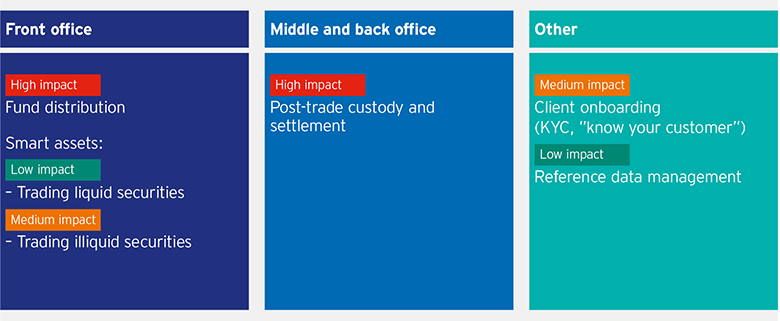

Blockchain offers the possibility of drastically redefining transactions, the structures and protocols of which remain largely inefficient. Simply defined, blockchain is a decentralized, distributed digital ledger system that records transactions in a secure, verifiable and permanent way. There are 3 benefits that it can offer:

1. Reduced costs 
2. Enhanced risk mitigation 
3. Greater efficiency.

Most stock exchanges favoured a period of 14 days for the completion of trades. In the 1970s and 1980s, this was cut to five and then three days with the advent of new technology. Today, the standard settlement cycle for many investment vehicles is two days. However,

1. By limiting the need for intermediaries (central counterparty clearing and central securities depositories), blockchain enables near-real-time settlement.

2. In addition to minimizing risk exposure, shorter settlement times create more liquidity for asset managers, freeing funds to be reinvested in shorter amounts of time.

Central counter-party clearing (CCP) manages the operational tasks of settlement to reduce risk and maintain market integrity. The central counter-party monitors the individual credit risks of individual trade participants, addresses defaults and oversees systemic risks in the market. Blockchain can streamline these management, monitoring and oversight functions through protocols known as **"smart contracts"**.

The Investment Management industry can be transformed by the widespread adoption of smart contracts, digital identities and other innovative blockchain components. Blockchain technology is still far from maturity. For Investment Management firms that take a conservative approach to adoption of new technologies, experimentation makes more sense, while aggressive firms are already implementing and commercialising blockchain solutions.

Over the next five years, blockchain solutions will move from proof of concept to being actually deployed in live environments performing a number of different processes across the IM value chain. This can later work as a foundation for future technological stacks that leverage its strengths in new applications.

Every investment manager has a value chain of activities that are performed to provide their services to customers, and within that chain some processes are more suited to transition to a blockchain infrastructure than others.

In the below figure, we provide an impact analysis description which categorizes different Front-office and Back-office processes and identifies the impact that blockchain technology can have over them.

Processes that have multiple parties granting approval, have strong audit, compliance, and regulatory oversight tend to be better suited for blockchain adoption.

# Front Office Operations

* **Fund Distribution [High impact]:-**  Fund distribution operations can be streamlined through automation by smart contracts.

* **Smart assets [High impact] :-** Blockchain can transform the smart assets market by representing real-world tangible assets through virtual tokens, easing out the transaction, transfer of ownership rights etc.

* **Trading liquid securities :-** Trading securities having high liquidity will not undergo huge transformations when shifted to blockchain platforms, although the underlying platform provides creative opportunities in terms of the kind of platforms that can be devised for trading.

* **Trading illiquid securities :-** Blockchain can make illiquid securities easier to trade by providing more liquidity and real-time transaction validation services, saving costs and increasing trading volumes.

# Middle and Back Office Operations

* **Post trade custody and settlement :-** Blockchain, through smart contracts and data feeds, can remove intermediaries and speed up settlement times, while parallely handling the regulatory requirements of the trade. Post trade workflows can go complete overhaul when integrated with blockchain platforms.

Currently, data reconciliation sits at the heart of most business models. However, because everyone maintains their own data, the process is beset with inefficiencies, such as the need for different parties to constantly message data back and forth between them to get things done.

Blockchain, by contrast, could enable a progression from today's multiple and sequential data reconciliation models to a much more efficient process in which reconciliation is an integral part of the transactional process.

Overall, IM firms have a lot to gain by integration of blockchain within front-office and back- office operations. However, the IM is governed by regulatory bodies and entails systemic risk. The global financing and banking systems will take some time to shift from legacy systems to blockchain solutions.

With a number of Proof-Of-Concept blockchain solutions being worked upon and many tested solutions being deployed in live environments, the shift is already happening.