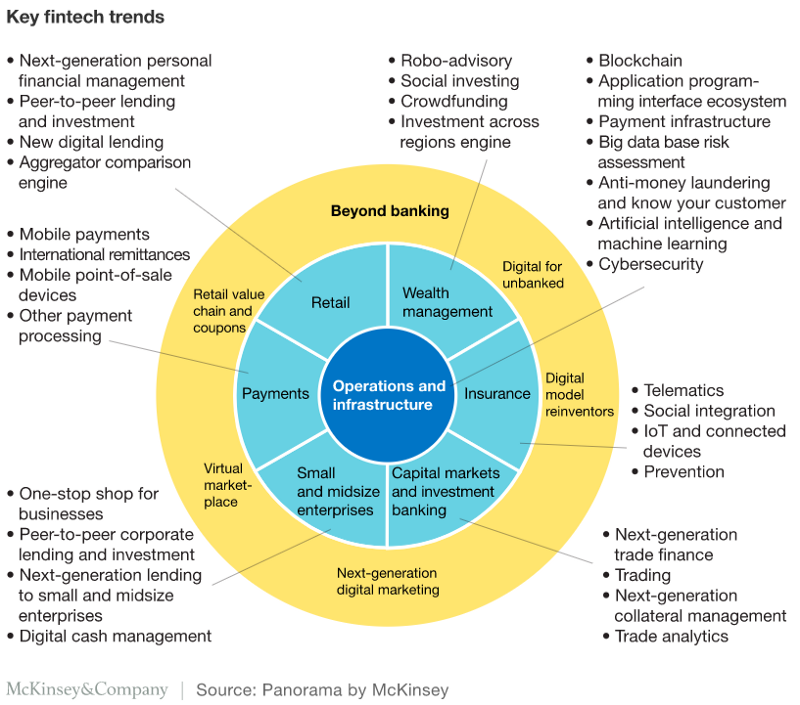
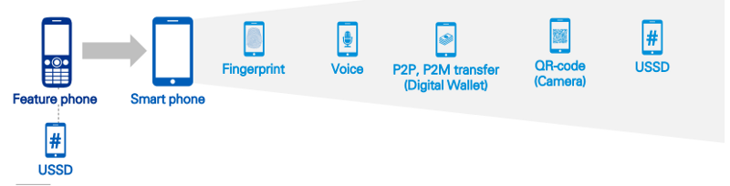

The innovations being brought by emerging Fin-Techs in regards with how financial / banking services can be provided by leveraging technological advances along with design has started shifting consumer demands and behaviours, is shaping the changes in the market conditions, and is bringing-in new regulations.

The scope of products and services offered by fin-techs has grown rapidly. Where once companies focused on payment applications, lending, and money transfers, the industry's reach has extended into more than 30 sub-financial sections .

In this section, some of the key fin-tech trends identified by the McKinsey are briefly discussed.

# OPERATIONS AND INFRASTRUCTURE ( Key Fin-Tech Trends )

If we look at the trends emerging in the financial Operations and Infrastructure space, these can be mainly categorised into the following categories - 

1. Blockchain
2. Application programming interface eco-system 
3. Payment Infrastructure 
4. Big Database risk assessment
5. Anti-money laundering and KYC
6. Artificial Intelligence and Machine Learning
7. Cybersecurity

We will briefly look at each of these categories, along with the examples, later followed by their use-cases. 

## BlockChain

* Established financial institutions have started integrating Distributed Ledger Technology (DHT) within their traditional software infrastructure and are using blockchain for intra-organizational projects over the coming years to reduce organizational complexity, improve efficiency, and reduce costs.
* Most of the attention surrounding blockchain is centered on the United States and Western European countries, particularly on the financial services industry, where the technology is expected to have a major impact due to its ability to reduce transaction costs.
* These firms have started testing distributed ledger technology solutions to address specific problems or to improve their business processes, including data reconciliation, clearance, settlement, regulatory compliance, and are using it to enter into new segments or markets.
* They are also entering into consortia (some more than one) to mutualize development and potential transition costs, as well as are racing to establish standards for the emerging technology

Example :-

* Digital wallet **AliPay** is adding a bitcoin option for its customers.
* Visa has partnered with blockchain company Chain to build Visa B2B Connect, an enterprise blockchain infrastructure to facilitate international financial transactions for their corporate clients.
* Traditionally, banks had the special permission to perform certain activities where a single bank did everything.

## API Eco - System
* Traditionally, banks had the special permission to perform certain activities where a single bank did everything.
* In the past, fintech Start-Ups were forced into obtaining a hard-to-get banking license as a regulation which presented a barrier to the industry.
* Nowadays, BaaS banks allow Fintechs to partner - using the bank's license while complying with regulations.
* Fin-techs simply offer banking services in easy-to-integrate bricks for other people to bring to their customers.
* Therefore, the new API banks allow Fintechs to have access and development that was previously reserved for traditional banks.
* Some API models give banks the opportunity to become platforms that connect, curate and manage new services offered by Fintech.
* The Banking as a Platform (BaaP) model allows API banks to keep "owning" their customers while offering the best financial product possible.
* As a result, Fintechs are allowed to focus on core activities and international expansion, making their services faster, more precise, and broadening their scope.

Example :-

* FinLeap's venture **SolarisBank** which offers a B2B2C banking platform model. It enables digital companies to offer financial services to their end customers. Simultaneously, it puts suppliers on the platform in order to give the partners the best Fin-tech services through a single API.
* If we look outside the Banking eco-space, Uber is a really good example which showcases the success of the API driven model. Uber mainly combines multiple API services offered by other companies, i.e.
    1. Positioning is done by the operating system (iOS, Android)
    2. Route calculation and maps are provided by MapKit and Google Maps
    3. Twilio sends real time text messages to the customers
    4. Payment is handled by Braintree
    5. The receipt is sent via Mandrill
    6. The services are hosted in the cloud on Amazon Web Services (AWS)

## Payments Infrastructure

* The financial services sector has witnessed a massive shift in the favor of digital, payment business services being at the forefront of this digital transformation.
* This shift can be attributed to a conglomerate of innovative headwinds that include the development of a robust infrastructure, evolving customer expectations, progressive government initiatives, and technological advancements.
* Globally, the non-cash transaction volumes have surged leading to a change in the power dynamics of the payment industry, which is witnessing a shift in the favor of digital.
* The following graph showcases the digital payments adoption across certain countries.

Example :-

* **Paytm** is India's Biggest platform in the e-wallet industry and e-commerce platform. Started by Vijay Shekhar Sharma in 2010, Paytm changed its business model to a virtual bank model, marketplace and gold e-wallet. It offers mobile payment solutions to over 7 million merchants allowing customers to make seamless mobile payments from cards, bank accounts, digital cards among others.
* **Adyen**, a FinTech unicorn that provides a single platform to accept payments anywhere in the world through any sales channel. Adyen enables businesses to process payments across online, mobile, and Point-of-Sale (POS) with over 250 payment methods in 187 transaction currencies. Already over 3,500 businesses use the Adyen payment platform, including champions like Airbnb, Booking.com, Spotify, Groupon, Evernote, Viagogo, Yelp, Vodafone, SoundCloud and JustFab.

## Big Database Risk Assessment

* Newer technology and trends have made big data analysis much easier to apply, with many Frameworks and platforms for collecting larger amounts of data being deployed and refined.
* This allows far more accurate risk management analysis and predictions, particularly in the areas of investment management and the "health" of derivatives.
* Data lakes now allow the gathering and synthesis of both structured and unstructured data as it is queried, without the need for local storage. Real-time data streaming technology now allows much faster assessment of incoming data.
* The three biggest advantages in using big data analysis for financial risk management are speed, efficiency, and greater reliability. The ability to work faster in decision-making gives organizations a competitive advantage.
* Working faster with larger amounts of data means:
    1. Predicting credit risks more accurately = better business decisions.
    2. Making lending and investment decisions based on longer histories.
    3. Getting data in real time to mitigate losses due to fraud and breaches.

* Applying big data to financial risk management also occurs in algorithm-based trading - something already in substantial use on daily market exchanges.

Example :-

* **Hexanika**, a Reg-Tech Start-Up is helping banks cut regulatory costs and skirt hefty fines for non-compliance. Hexanika estimates that banks have paid $300 billion in fines since the 2008 financial crisis. It is a data management and reporting solution for financial institutions. Their software uses an algorithm that can source and ingest data in multiple formats to normalize datasets. The Saas is powered by Hadoop, an open-source data computation software. The company is providing their solutions to financial institutions and helping them keep pace with changing regulatory requirements by leveraging Artificial Intelligence (AI).
* **MindBridge Analytics** uses AI and ML to detect "anomalous patterns of activities, unintentional errors and intentional financial mis-statements" in financial datasets. The auditing software will automate ingestion and analysis of data and help accountants identify risk. A risk score is generated for all data processed and will flag transactions that need to be investigated. By using AI, the platform hopes to serve as the update to widely used computer-assisted audit techniques (CAAT).

## Anti-Money laundering and KYC
* With the emerging Fin-Tech players comes the need to monitor and keep these new players accountable.
* KYC is the process that allows businesses to identify who their customers are. This is particularly important to financial companies, as it lets them put faces to client names, preventing illegal activities like money laundering, tax evasion, or terrorist financing.
* Harnessing the power of big data and A.I , the regtech sector is working towards reducing financial risk, increasing regulatory compliance and stamping out laundering and fraud.
* The Financial Industry Regulatory Authority (FINRA) noted that regtech tools, those that help maintain up-to-date records and facilitate transparent financial deals, have the potential to fundamentally transform how securities industry participants perform their compliance obligations.

Example :-

* **ComplyAdvantage** is an AI-driven risk management database for companies that can potentially be hurt by financial crime. The company's proprietary Anti-Money Laundering (AML) data feed creates profiles, automates customer monitoring with KYC and due diligence tools and screens payments in real-time. The ComplyAdvantage platform is currently used by more than 350 companies in money-transferring industries, including payments, stock trading and even gambling.
* **Ascent's platform** is built around "channels" that are derived from individual regulatory bodies. The company's platform uses AI to find and house all applicable rules and regulations that effect a company in real-time. Consequently, Ascent users can use their personalized platform to quickly discover documents and regulations (from multiple regulatory agencies) that help maintain financial compliance.

## A.I and Machine Learning
* In the early ages of Banking, bankers used to have personal connections to their customers to help them assist well for their decisions. But in this digital world, this personal connection is lost.
* Artificial Intelligence (AI) at many levels can be leveraged to bring back that connection. Artificial Intelligence and Machine Learning can process the huge amount of information about customers.
* This essentially means finding what's right for your customers and hence can achieve customer satisfaction at the high level.
* Some of the potential use-cases of Artificial Intelligence are :-

    * **Accurate decision making** - Data-driven management decisions at lower cost lead to a different style of management,
    * **Automated customer support** - Chatbots can deliver human-like customer service or expert advice experience at a low cost.
    * **Predictive analysis in Financial Services** - Predictive analytics in financial services can directly affect overall business strategy, sales nurturing, revenue generation and resource optimization.
    * **Automated Virtual Financial Assistants** - Automated financial assistants and planners assist users in making financial decisions.
    * **Fraud detections and Claims Management** - Analytics tools collect evidence and analyse data necessary for conviction. Artificial Intelligence tools then learn and monitor user's behavioural patterns to identify rarity and warning signs of fraud attempts and incidences.

Example :-

* Swiss startup **ParaShift** develops AI-based accounting document management technologies which it offers through a SaaS platform and APIs. The company has built a machine learning platform that's capable of reading all kinds of accounting documents such as invoices, cash receipts and credit card receipts with unprecedented accuracy and extract documents entirely autonomously.
* **NetGuardians** is a Swiss fin-Tech helping over 50 Tier 1 to Tier 3 banks worldwide to fight financial crime. NetGuardians has developed an "augmented intelligence" solution made for banks to proactively prevent fraud, empowering clients with machine learning technology together with contextual information and great user experience.

## Cyber Security

* Being a subset of the financial services domain, FinTech is targeted by hostile cyber villains. Industries thus require secure mechanisms to keep their data safe and secure. Preventing data losses are critical for Fintechs.
* The major cybersecurity risk that enterprises implementing FinTech face are from integration issues such as data privacy, legacy, compatibility, etc. Hackers target FinTech as they handle large volumes of customer data that include personal, financial, and other critical information.
* In this digital era of increasing cybersecurity attacks and malpractices, AI can be used effectively to prevent risks and attacks. The following are major ways of how AI and ML protect FinTechs:

    * **Fraud Detection :-** AI and machine learning algorithms are used to detect frauds in FinTechs by being able to identify transactions in real-time accurately.
    * **Controlling Access :-** Access control to critical data is crucial when it comes to security. Machine learning is used to derive critical insights from previous behavioral patterns such as geolocation, log-in time, etc to control access to endpoints.

*  It is expected that cyber threats and crimes will increase due to the expansion of internet access and cloud computing. Consequently, the predictions are that the cybersecurity market will substantially grow in the coming years.

Example :-
    * **CyberCentric** is an enterprise-focused cyber security platform that monitors sensitive data and controls access to prevent unauthorized use.
    * **Source Defense** leverages a fully automated, machine-learning set of policies that ensures the integrity of 3rd party JavaScript integrations operating on your website. With Source Defense, companies can maximize user experience and eliminate the risks associated with 3rd party integrations such as Magecart and Formjacking attacks.

Here's the link to the next article <strong><a target="_blank" href="https://cryptowhaler.github.io/2020-07-19-FinTechSectorAnalysis2/" class="list-filter">FinTech Startups & The Established Financial / Banking Institutions : PART — II</a> </strong>