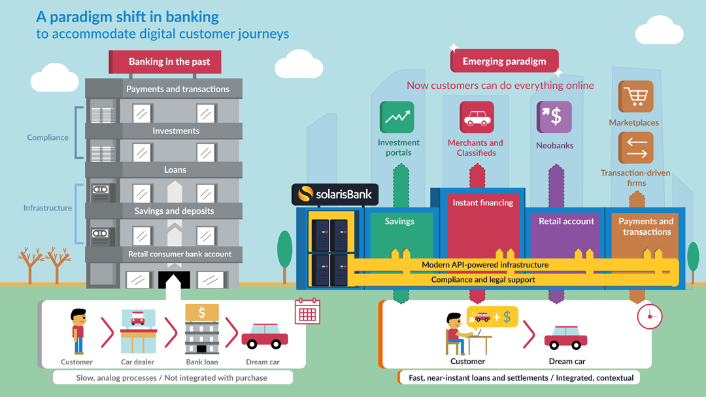

The innovations being brought by emerging Fin-Techs in regards with how financial / banking services can be provided by leveraging technological advances along with design has started shifting consumer demands and behaviours, is shaping the changes in the market conditions, and is bringing-in new regulations.

I discussed various trends emerging in the financial Operations and Infrastructure space in my previous article - <strong><a target="_blank" href="https://cryptowhaler.github.io/2020-07-03-Startups_Institutions1/" class="list-filter">FinTech Startups & The Established Financial / Banking Institutions : PART — I</a> </strong>

Here, we will look at various emerging market sectors within different banking verticals whose growth is fuelled by the technological advancements happening in the financial operations and infrastructure space. 

# WEALTH - MANAGEMENT
1. **Robo-advisory -** Robo-advisors are online services that use algorithms to automatically perform many investment tasks done by a human financial advisor.Example - **Betterment, Wealthfront, Fidelity Go** are some of the most popular robo-advisors active in the fin-tech space.

2. **Social Investing -** Social investing or ethical investing, is any investment strategy which seeks to consider both financial return and social / environmental good to bring about social change regarded as positive by proponents. Socially responsible investing is one of several related concepts and approaches that influence and, in some cases, govern how asset managers invest portfolios.
Example - **Impact Engine, Reach Capital** etc.

3. **Crowdfunding -** These are platforms that allow a collection of individuals to provide monetary contributions for projects or companies provisioned in the form of equity.
Example - **KickStarter, CrowdCube, GoFundMe** etc.

# INSURANCE
1. **Telematics**- Telematics refers to the handling of seamless insurance transactions, while streamlining the process of insurance. The insurance industry ( Example: auto industry ) has been using the same tactics to determine risk and price for years.
Telematics is disrupting the way insurance companies write policy by offering insurers data on driver habits that can be used to influence policy price and coverage. Example -
* Elon Musk, the founder of Tesla, is rumored to be entering the insurance business. In the past, insurers have relied on basic information about the vehicle and driver to craft a policy.
* With telematics, data gathered from transmitting devices paired with AI and ML work together to create a comprehensive risk analysis, helping insurers write more accurate policies.
* **Cambridge Mobile Telematics (CMT)** develops innovative mobile sensing technology and data analytics to improve driving behavior and make roads safer around the world. Their products are used by drivers worldwide in smartphone applications, triggering significant changes in the global insurance market.

2. **Social Integration** - If social media was the most important marketing and communication trend of 2010–2020's, then fintech promises to deliver the most radical changes in the conduct of financial services in 2020–2030's. Currently, the line between the two is set to blur. Focusing on just data may actually miss the point. Artificial intelligence (AI) can turn a social media channel into a self-improving business system, changing not only the product, marketing and compliance but also the entire business strategy.
Example -
Existing and new banks as disparate as DenizBank in Turkey and Amex worldwide, have been integrating Facebook and bank accounts, using Facebook to run their entire online financial lives, and optimising their marketing efforts at customers based on data-mining drawn from Facebook.

3. **IOT and Connected devices** - IoT has given the fintech industry an interesting boost when it comes to security and payment processing. The Internet-of-Things can be found acting as mobile point-of-sale systems, as well as, cybersecurity tools that safely process and encrypt payment information. The IoT plays a variety of roles:

    * It simplifies debt collection by monitoring supply chain activity via sensors and networks.
    * It improves fraud protection by employing on-site security systems that sense every network connection and potential connection.
    * It optimizes what's called "capacity management" to enhance customer service.
    * Using beacons, it can even help with indoor navigation and security at bank branches or other institutions.

Example - **Dynamics INC** makes IoT-connected, battery-powered interactive payment cards that provide two-way communication between banks and clients in real time. Each card has a display screen through which bank clients can ask questions and get quick answers. The so-called "Wallet" sends the bank a notification containing details about when, where and how payments were made.

4. **Prevention**- People seeking to engage in fraudulent schemes are attracted to an industry that is on the cutting edge of technological development where they see opportunities to exploit weaknesses in data protection. Identity theft, and "phishing", are two of the more common types of fraudulent devices that are employed, in addition to other sophisticated fraudulent schemes.

One way the FinTech industry has been supplementing traditional fraud prevention policies and programs is through the continued development of machine learning fraud prevention approaches using AI. With machine learning, a computer is able to recognize schemes that are likely to be fraudulent by analyzing prior data and then making decisions with respect to ongoing transactions, with or without continuous human interaction.

Example -** Signifyd** is a fraud prevention startup that allows you to accept more international and domestic orders while reducing your risk of having to deal with fraudulent transactions, chargebacks and other common payment-related issues.

# CAPITAL MARKETS & INVESTMENT BANKING

1. **Next - generation trade finance**

* Traditionally, Trade Finance operations relied on manual, paper-based processes that were duplicated across multiple parties. The net result was that these activities remained extremely costly, time intensive and inefficient.
* At every point of the Trade Finance process, there are major inefficiencies, as well as security and compliance risks - with heavy fines and an abundance of regulatory obligations.
* To overhaul the Trade Finance industry and more specifically - the documentation process, digitalisation and leading-edge technology are now the key areas of strategic focus - driven by the promise of potential cost reductions, efficiency and compliance benefits.
* New digital, cloud-based, platforms are emerging that enable banks and corporates to complete Trade Finance transactions swiftly - rather than in days.
These platforms work by scanning trade finance documents and extracting the data using advanced Optical Character Recognition (OCR) software which the platform can use downstream. Subsequently, the data is run through a very sophisticated AI and machine learning-based, algorithmic rules engine.
* These platforms are able to come up with responses and decisions which humans currently take on a daily basis, enabling the entire process to become data-driven - as opposed to paper dependent - with an exceptionally high rate of accuracy and precision.
* These automated steps include document discrepancy-checks, due-diligence, and regulatory and compliance screening.
* This new technology wave promises to reduce the costs and complexities of Trade Finance for banks and corporates, and even enhance working-capital management.
* The use of Smart contracts (i.e. digitised contracts), AI and Machine Learning to automate processes - ensures a more streamlined operational process across the whole Trade ecosystem.

Example - **Taulia** is a financial technology business that provides working capital management, electronic invoicing, supply chain finance, and dynamic discounting services. The company helps buyers and suppliers accelerate payments, improve supply chain health, and unlock trapped cash.

2. **Next - generation collateral management**

* Collateral management has evolved rapidly with the increasing use of new technologies, competitive pressures in the institutional finance industry, and heightened counterparty risk from the wide use of derivatives, securitization of asset pools, and leverage.
* Collateral management is being moved to the front office as Institutions now place greater importance on it following the 2008 financial crisis.
* This is being driven by a shift in attitudes, as a process that was traditionally seen as purely a cost centre is now viewed more as an opportunity or even an asset class.
* We see a common theme running through five areas in collateral management : the application of smarter data and intelligence to drive core business objectives.
* Many firms have understood the basics of collateral optimization and are now trying to incorporate a broader set of parameters and even a new definition of what optimization means.
* Technological investments in collateral are starting to tie into broader innovation projects at larger firms.
* This will unlock new value-added opportunities for both internal and external facing technology applications.

Example - **CloudMargin** was formed in 2014 by a team of professionals with several decades' combined experience in collateral management, OTC derivatives, technology and capital markets. Inspired by the power of new technology and driven by the belief that existing collateral management solutions were over-priced, inefficient, and inaccessible, CloudMargin works to bring effective collateral management to all market participants, regardless of size or status.

# BEYOND BANKING
Beyond banking means a platform-based business approach where multiple services are provided to customers in an integrated and coherent suite through an ecosystem of different service providers. The services provided can be from any type (e.g. mobility, security, delivery, home security), and banks can participate by providing niche and tailored financial services that consistently integrate the suite of services.

For example, social networking platforms can be built on the top of blockchain infrastructure where a user can earn money for sharing content based on user engagements. This is just one of the possibilities in which fin-tech can revolutionize other established industries.