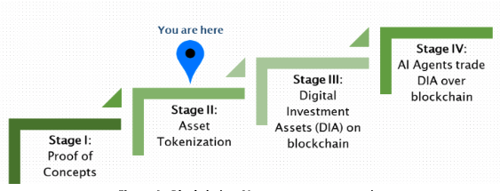

Around 1969, a military research program called ARPANET was launched by the Defence Advanced Research Projects Agency (DARPA) which promoted the sharing of super- computers amongst military researchers in the United States. ARPANET was the precursor of today's internet.

The Evolution of InternetFast forward to 1993, the first GUI browser, NCSA Mosaic, was released. In 1995 Netscape Browser was released, which marked the time when the internet started going mainstream.

The next iteration of the Web brought on the rise of corporate internet giants such as Google, Facebook and Amazon. Then in 2008, Bitcoin introduced a revolutionary technology and became the first digital currency, revolutionizing finance. 

Ethereum extended the concept by adding decentralized computing architecture to the blockchain, showcasing just one of the unlimited ways in which the blockchain architecture can be utilized.

It is an undeniable fact that artificial intelligence (AI) and blockchain concepts are spreading at a phenomenal rate, both technologies having distinct degree of technological complexity and multi-dimensional business implications.

The overall impact over the society that these technologies are currently having is often referred to as the 4th Industrial Revolution, the AI being the DNA and the Blockchain having the potential to revolutionize our established monetary systems and infrastructure.

Artificial Intelligence solutions running on top of the blockchain tech-stack are already being introduced by many fin-tech startups and this technology is expected to experience wide-scale adoption within the next 3–5 years, thereby increasing machine learning capabilities within the financial domain and even having the potential to create new financial products.

_"Blockchain-AI convergence is inevitable because both deal with data and value. Blockchain enables secure storage and sharing of data or anything of value. AI can analyze and generate insights from data to generate value."_

The evolution of the Blockchain technology stack is currently divided into 4 stages, with the hypothesised blockchain-AI convergence process expected to begin in stage 4:

* **Stage I:** Blockchain proof of concepts
* **Stage II:** Tokenization of assets on blockchain
* **Stage III:** Digital investment assets traded on blockchain, powered by A.I Algorithms
* **Stage IV:** A.I driven economic agents that trade digital investment assets

## The 2nd Stage 
* We are currently in the second stage where many established firms and emerging start-ups are tokenizing the financial assets which can then be traded on blockchain. Tokens can represent underlying securities, physical assets, rights to cash flow, or utilities. 
* The tokenization based transaction processing over blockchain reduces the transaction costs and the settlement time, improves liquidity, while improving audit ability. 
* It further allows the application of AI and machine learning for pattern recognition and predictive algorithms for further value generation from the data.

## The 3rd Stage
* The third stage is expected to see the introduction of native digital assets. 
* Tokens are expected to go from representing an underlying asset to becoming the underlying asset. 
* While this concept is hard to digest now, it will be helped by the future explosion of complex blockchain data. 
* This kind of financial engineering is expected to create new revenue sources for the financial firms which would have strategically positioned themselves within the financial by developing the needed infrastructure so that this opportunity could be properly utilized for further business expansion when it arrives.
* These native digital assets being theorized will be highly exotic products, and will be created by either human or AI-driven financial engineering. Their risk, predictive and pricing models will be AI-driven because they might be too complex for humans.

## The 4th Stage
* The fourth stage is currently hypothesized to involve A.I becoming economic agents, where A.I algorithms will actively trade digital investment assets over a blockchain-powered tech stack. 
* Evolutionary (genetic) algorithms could generate, test and trade multiple strategies, kill off under-performing strategies, and continually tweak the winning strategies to maximize trading profits. All with minimal human supervision.

The above currently theorised expected evolution of the emerging blockchain tech-stack possible by the convergence of blockchain with A.I will have huge impact especially over the financing / banking sectors,  an opportunity that the businesses will make most out of who would have positioned themselves in the market while additionally having the say in the creation of econometric and financial systems of the future.