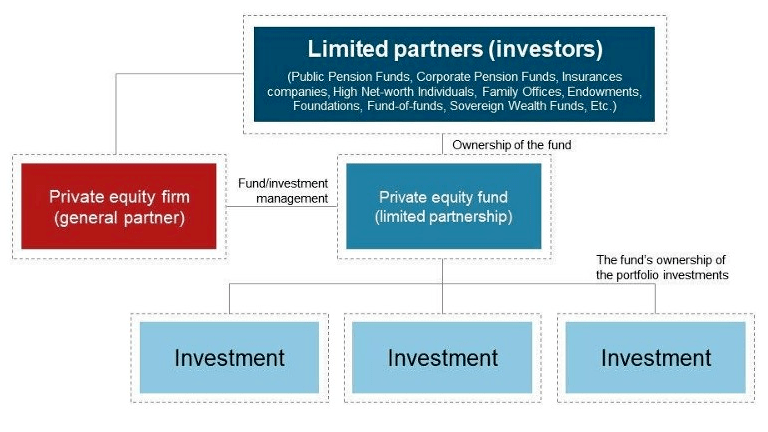
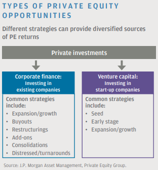
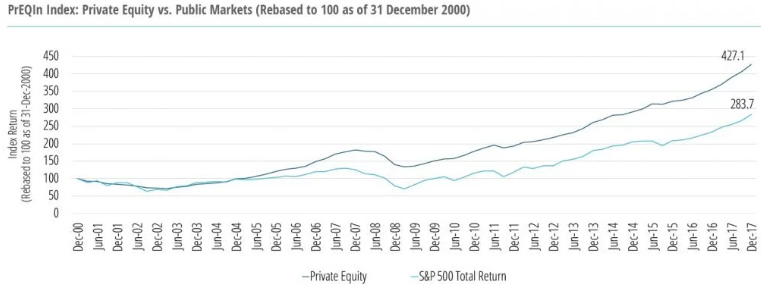

My upcoming articles discuss different aspects related to Investment firms, private equity firms and the secondaries market. So i thought it would be nice if i will briefly introduce  them here.

# Investment Management Firms

## Asset management firms

These firms invest the pooled funds of retail investors in securities in line with the pre-defined investment objectives for a fee and provide more diversification, liquidity, and professional management consulting service than what is normally available to individual investors.

The diversification of portfolio is done by investing in such securities which are inversely correlated to each other. Money is collected from investors by way of floating various collective investment schemes, e.g. mutual fund schemes.

## Private investment funds

These do not solicit capital from retail investors / general public, which gives them an advantage as the regulatory and legal requirements they are subjected to are much lower than what is required for funds that are traded publicly. Hedge funds and private equity funds are two of the most common types of private investment funds.

Many hedge funds are private investment funds as it allows them to use aggressive trading strategies that the manager of a public fund would avoid due to the potential for investor lawsuits resulting from unreasonable risk-taking. Further, there is no public reporting of positions for private investment funds, which allows them to avoid tipping their hand to the market and eroding the profitability of a strategically built position.

### Hedge Funds
* Alternative investments that use pooled funds and employ a variety of strategies to earn returns for their investors. They aim to provide the highest investment returns possible as quickly as possible.
* They usually trade in highly liquid assets, enabling the fund to take profits quickly on one investment and then shift funds into another investment that is more immediately promising.
* They tend to use leverage / borrowed money to increase their returns.

### Private Equity Funds
* These invest directly in companies, primarily by purchasing private companies, although they sometimes seek to acquire controlling interest in publicly traded companies through stock purchases.
* Unlike hedge funds focused on short-term profits, private equity funds are focused on the long-term potential of the portfolio of companies they hold.

### Hedge Funds VS Asset Management Firms
The main difference between hedge funds and traditional institutional asset management firms is that hedge funds focus on absolute returns, whereas money managers focus on relative returns.

# Private Equity and Secondaries

## PRIVATE EQUITY - Investing and Generic Structure 

* Private equity investing refers to the equity investments made in companies that are not currently publicly listed; meaning they are not traded on a stock exchange.
* PE investment opportunities fall into two main categories - corporate finance and venture capital .
* Investment in private equity is usually done through fund structures.
* Fund structures generally take the form of limited partnerships managed by general partners (GPs) who raise capital from investors, invest alongside these limited partners (LPs) to identify and select portfolio company investments and usually have a significant level of engagement in the management of these companies.
* Investors can access the secondary market for PE, through which a limited partnership or company interest can be transferred from the seller to the buyer.

## Private equity Secondary market
* The private equity secondary market (often called private equity secondaries) refers to the buying and selling of pre-existing investor commitments to private equity and other alternative investment funds.
* Because of the absence of established trading markets for these interests, the transfer of interests in private equity funds as well as hedge funds can be more complex and labor-intensive.

## Private Equity vs. Public Markets
* Investors are primarily interested in the private equity (PE) because of its better return enhancement potential. A well-implemented private equity portfolio may achieve a return of 4% to 5% in excess of public equities over the long term.

* PE investments usually have a long investment period (8–10 years), are relative illiquid and carry a return profile that may be negative in the early years and positive in the middle to late years.
* Private equity's attractive return potential is usually realized by the firms through a diversified private equity portfolio strategy, which is executed through a disciplined, multi-year program that invests in top funds and opportunities.
* Diversified commingled vehicles managed by the experienced private equity investors have the potential to provide access to top-performing private equity funds, as well as high quality direct and secondary investments, in a portfolio constructed to deliver attractive risk-adjusted returns while minimizing administrative burdens.

# Crypto-currencies as an Alternative Investment

Alternative investments are generally defined as "non-correlated assets," meaning that their performance doesn't follow that of more traditional asset classes such as stocks and bonds. Because of this, they are used to provide an effective hedge against market downturns. They are generally used to balance risk in a portfolio and to provide a "cushion" in the case of a stock or bond meltdown and are appropriate in a small portion of your overall portfolio.

Bitcoin was the first digital currency to rely on a decentralized peer-to-peer network instead of a trusted third party. After Bitcoin's emergence, many other crypto currencies entered the market and the market has witnessed enormous price increases over the years . The combined crypto-currency market value increased from around $11 billion (2014) to around $100 billion (2017), an increase of over 800%.

Many independent researchers have found that cryptocurrencies provide larger returns with a higher dispersion than traditional asset classes and at the same time show a higher level of volatility. 

The relation of the magnitude for positive returns and negative returns is larger for cryptocurrencies compared to asset classes, meaning that cryptocurrencies provide large returns more frequently and of potentially larger magnitude compared to traditional asset classes. 

_With these results we can argue that investing in cryptocurrencies provides larger returns per unit of risk compared to investing in traditional asset classes._

In terms of using cryptocurrencies to improve portfolio diversification, combining different cryptocurrencies in a portfolio provides beneficial diversification effects.

The cryptocurrencies market and the related research is still in its beginning and there is still a lot of progress to be made. For now, it has been observed that investments in cryptocurrencies provide large return potentials with high levels of volatility while at the same time provide a higher level of return per level of risk compared to traditional assets.