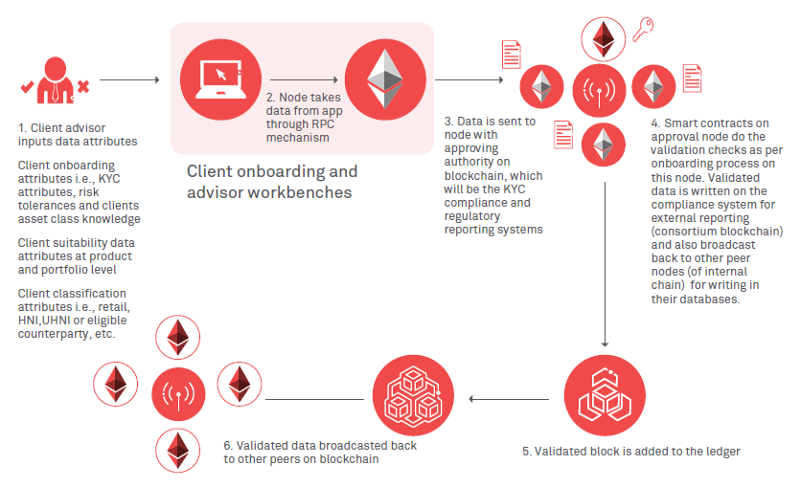
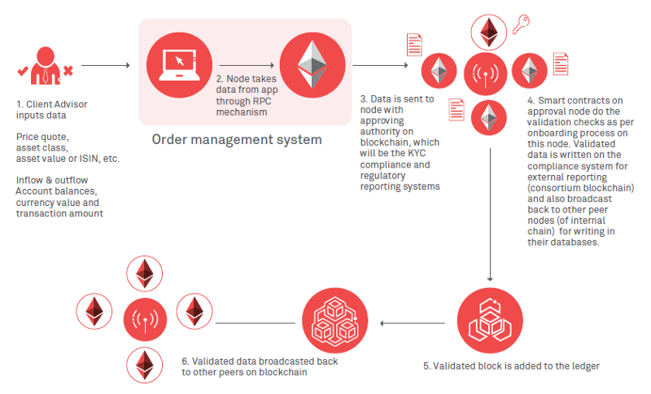
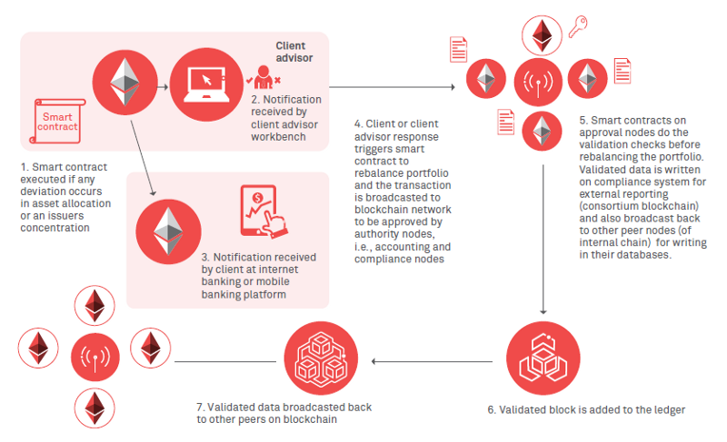

Most legacy systems at private investment and asset management funds are much more expensive than blockchain technologies, are subject to human error, and take much more time. Banks charged $1.7 trillion in processing fees in 2014.

However, Blockchain technology is highly flexible and has a number of potential use cases within the asset management lifecycle. Once implemented, it can be used to streamline management of portfolios, speed clearing and settlement of trades, and ease compliance burdens associated with anti-money laundering (AML) and know your customer (KYC). It can eliminate redundant functions, reduce operational expenses and increase opportunities to enhance the client experience.

Many firms have even fully automated the hedge fund secured by blockchain technology. This is accomplished by improving the administrative procedures of private equity deal making, or using crypto-currencies as incentives for data scientists' competitive models that facilitate investment analysis efficiencies. 

Examples include private investment funds such as Polychain Capital, the Northern Trust in cooperation with IBM, Numerai, LendingRobot, and Intellisys Capital LLC, Vega Fund, and Melonport, among many others.

As the use of blockchain technology grows and the technology matures, the innovation, cost and automation benefits for private investment funds and their clients promise to result in lasting change for the industry.

## Limitations of established business models fabricated upon legacy systems

Currently, the established wealth and asset management industry (hedge funds, investment firms) is running on legacy business models and processes fabricated upon decades-old technologies.

* These legacy systems and processes often have costly data maintenance requirements and pose severe threats to client-related sensitive data, transactional data and the institution's reputation with clients and regulators.
* Any leak of such data often leads to hefty monetary fines and the loss of customer trust.
* Many legacy systems are not flexible enough to implement new workflows as per the evolving market needs.

## Business model Innovation possible by blockchain
It is now validated that blockchain technology can improve and optimize an institution's service quality for a range of processes such as-

1. **Client on-boarding** - KYC processes
2. **Asset transactions** - real-time settlement models
3. **Portfolio management** - automated rebalancing of portfolios through smart contracts

It is currently expected that blockchain technology will be first applied to solve business needs for asset management firms' middle-office and back-office internal processes, and then eventually as a widespread client solution.

_However, many emerging investment management firms are already leveraging blockchain and A.I together to devise novel business models which optimize the internal processes and brings the cost structure down, while the use of blockchain (tokenization) and A.I (portfolio management automation) allows them to tap into markets which have traditionally not been explored._

**For hedge funds**, it is expected that blockchain will start out as an internal solution to track investors and ownership without relying on a fund administrator.

* Rather than stacks of paperwork and manual mechanisms for monitoring complex ownership structures and subsequent changes, portfolio managers will use distributed ledger to manage ownership of complex assets and investment vehicles in real-time.
* It will allow Investors to securely check their holdings and investment allocations whenever they want in real-time, and will facilitate the hedge fund managers by drastically reducing the time required to assemble complex statements / performance reports.

## Blockchain Use-Cases for middle office and back-office workflow optimization
In a blockchain environment, an organization can run on two (or maybe more) different chains, i.e., one interacting with the external bodies like consortia, and another internal to the firm. Further, standards can be established to allow transfer of data / tokens from one chain to another.

This allows us to create business infrastructures, especially pertaining to financial services (dealing with transfer of value), with optimized operations and work-flow, and in some cases even allows for complete end-to-end automation of business processes.

Although very few firms (if any) have adopted the full automation route, many emerging firms have leveraged blockchain along with A.I (for fraud-detection, bad trade identification, portfolio management and algorithmic trading) to automate a large part of their business processes, and it seems very likely that in the coming years we may see investment start-ups employing end-to-end fully automated business models, limiting human involvement to compliance and safety checks.

_Below, we will be providing a basic overview in regards with how many of the middle office and back office operations common in the asset and investment management firms could be deployed over the blockchain infrastructure._

### 1. KYC and Client On-boarding using Blockchain

* Client advisor will input data attributes into the system which communicates with the Client on-boarding and advisor workbenches nodes through RPC mechanism. Data attributes refer to the following –
    *  Information needed to satisfy the KYC requirements.
    *  Risk tolerances and the client's preferred asset classes (if any).
    *  Other internal attributes which will be filled by the advisor himself, like eligible counterparty, UHNI etc needed for client classification and caters to internal data analytics.

* Once the data inputted by the client advisor reaches the Client on-boarding and advisor workbenches node, it is then sent to the node with the approving authority on the blockchain. These nodes will be the KYC compliance and regulatory reporting systems.

* Smart contracts on the approval node will perform the needed validation checks as per the on-boarding process, and the validated data will then be written on the compliance system for external reporting (consortium blockchain) while also broadcasting the same to other peer nodes (internal chain) for storing it in their databases.

* After the validated data is added to the ledger, it broadcasts data to other peers on the blockchain. This concludes the client's on-boarding and KYC process.

Further A.I could be implemented with the smart contract layer for data analytical and fraud detection purposes, and also to identify the possible reason in-case the validation checks fail.

### 2. Trade Booking and Settlement using Blockchain

Once clients have been on-boarded over the platform, the next step involves setting up of the client portfolio, which includes setting up the bank account (adding an already existing bank account), setting the limits and placing the trade booking orders.

We will provide a workflow in regards with how blockchain and smart contracts can be utilized for trade booking and the settlement process.

* Once the client has been on-boarded, the client advisor can input the attributes needed for trade booking purposes, such as asset class, inflow and outflow account balances, currency value, transaction amount etc.
* The inputted information will be communicated through RPC mechanism with the order management system.
* Once the data inputted by the client advisor reaches the order management system node, it is then sent to the node with the approving authority on the blockchain. These nodes will be the compliance and regulatory reporting systems.
* Smart contracts on the approval node will perform the needed validation checks as per needed, and then the trade booking data will then be written on the compliance system for external reporting (consortium blockchain) while also broadcasting the same to other peer nodes (internal chain) for storing it in their databases.
* The internal chain will then execute the trading process and the settlement will involve the transfer of security tokens (representing the desired asset class) to the client's account over the blockchain.
* The internal chain will then report back to the order management system when the trade is completed.
* After the transactional data is added to the ledger of the trade management system, it broadcasts that data to other peers on the blockchain. This concludes the client's on-boarding and KYC process.

The internal chain may communicate with the algo-trading algorithms to execute the trades and tokenization can be used to automate the securities settlement process, while A.I handles the trading and portfolio management process.

### 3. Portfolio Rebalancing and Client Book Building using Blockchain 

Client book building is a critical aspect of the wealth management business; it enables client advisors to understand client needs, bring in new business opportunities and enhance their relationship with existing clients.

We will provide an example of using blockchains and smart contracts for portfolio rebalancing in client book development.

* Once clients are on-boarded, and their portfolios set up, smart contracts on a blockchain network can actively monitor the client book.
* A smart contract will be triggered if there is any change in asset allocation within a portfolio or the bulk risk for a single asset class increases beyond a threshold value, resulting in sending alerts to clients and their financial advisors in real time.
* The client portfolio will be realigned based on the client or advisor response through available channels.
* Several other rules can be implemented in smart contracts regarding the client's investment suitability review as well.

    

## E&Y over the application of blockchain within the asset management firms -

Global consulting firm Ernst & Young highlighted in its 'Blockchain in Wealth and Asset Management' report, the block chain's potential for model portfolio management as well as direct client communication as one of the best use cases for the technology in the fund management industry.

According to E&Y, through the implementation of blockchain technology, the creation and communication of model investment portfolios for fund management clients could be greatly facilitated.

Currently, wealth managers utilize a range of different platforms to build and maintain investment portfolios and the majority of these platforms do not enable fund managers to communicate with the client directly.

Through the development and implementation of a blockchain-based solution, wealth managers could build and manage investment portfolios that are specifically tailored to clients' stored investment constraints and risk profiles and could communicate directly with clients about any change in their portfolios.

This could make the entire investment management process more efficient and relationships with customers could be deepened through direct fund manager to investor communication. Moreover, smart contracts could be used to manage fee payments every time a model portfolio is purchased by a customer.

Example - The **FundsDLT** blockchain platform enables fund managers to sell funds directly to investors, thereby reducing both the cost of administration and transaction times. Orders are placed with the FundsDLT smart contract platform, at which point all information related to the transaction is transmitted to all involved stakeholders. Additionally, FundsDLT streamlines the compliance processes as customers will not have to be verified by each involved party.

## Conclusive Remarks

Most large fund advisers in the private equity and hedge fund industry have not yet considered implementing blockchain technology in combination with big data applications and artificial intelligence.

This, however, may change in the foreseeable future if and when larger managers realize that their smaller competitors who utilize these technologies gain substantial operational efficiencies and cost savings and are able to substantially diversify their portfolio holdings via such technologies.

The threshold for change for bigger managers may be dictated by the implementation cost of such new technologies. If and when the long-term benefits of using the technologies exceed the implementation cost, which are much larger for larger managers than for the smaller managers who are currently experimenting with such technologies, larger managers will be incentivized to start the innovation process as well.

The infrastructural changes being brought by Blockchain and the analytical powers provided by A.I have started making in-roads in this space. Although these are bound to change how Investment management firms have historically operated, the innovations being brought by them does provide a window of opportunity to innovators to create new kind of Investment management structures, of the likes which were not possible before and do provide greater advantages over existing ones. 

With Ethereum and smart contracts not being older than 5 years, it is only a matter of time that we will start seeing developments happening in this space!