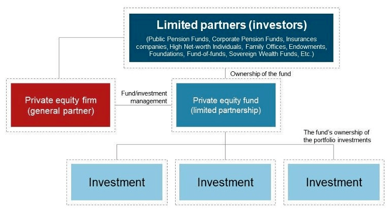

# Introduction to Private Equity and Secondaries

## Introduction to Private Equity

* Private equity investing refers to the equity investments made in companies that are not currently publicly listed; meaning they are not traded on a stock exchange.
* Investment in private equity is usually done through fund structures.
* Fund structures generally take the form of limited partnerships managed by general partners (GPs) who raise capital from investors, invest alongside these limited
partners (LPs) to identify and select portfolio company investments and usually have a significant level of engagement in the management of these companies.
* Investors can access the secondary market for PE, through which a limited partnership or company interest can be transferred from the seller to the buyer.

## Introduction to Private Equity Secondaries

* Private equity secondaries refer the sale of an investor's (limited partner) interests in a private equity fund or portfolio of interests in various funds.
* This happens through the transfer of the investor's limited partnership (LP) or LLC Member ownership interest in the fund(s) from the selling LP to the buying LP.
* The buyer takes on all the rights of the associated interest including any commitments to capital.
* Funds that are 5–10 years old are most suitable for secondary sales.

2018 saw an all time volume high in closed private equity fund secondaries at $70-$80 billion, growing from a decade ago when total annual market value of secondaries market was at $16 billion. Further, secondaries have demonstrated lower risk and a higher median IRR by strategy.

Because of the private equity asset classes long standing ability to generate alpha, private equity managers continue to raise record sums and institutional investors continue to allocate capital to private equity.

It is further estimated that private equity (PE), the largest private asset class, will continue to outperform public markets over the coming years. However, this advantage in performance comes at a cost, as the investments in PE are illiquid. Investors generally are expected to lock-up their capital for 10 years in exchange for the potential of higher returns.

_Currently, small investors do not have a way to access this asset class. Blockchain-based private equity shares (security tokens) could prove as a means to allow a new audience access to this attractive investment class._

Today it is increasingly popular for LPs to sell assets before the agreed fund term (around years 5–8) to realize gains and make adjustments to their existing portfolios. Hence, this demand for liquidity before fund term (usually > 10 years) created the secondaries market.

## Benefits of Secondaries vs. private equities
* Secondaries provide relatively shorter investment duration, cash back in 3–6 years versus 10 or more in the case of PE.
* Secondaries provide improved visibility of the underlying assets. Investors can evaluate what is already in the portfolio versus a blind commitment to the fund manager as is the case for PE.
* Decreased J curve effect for secondaries, as cash distributions are already in place
* Access to new funds / managers in the case of secondaries.

Thanks to secondaries ability to remove some of the startup risks of primary fund, investing in secondaries can provide more efficient access to alternative assets.

_An increasing number of diverse portfolios are coming to the market and more buyer and seller types recognizing the secondary market as a viable portfolio solution._

## The problem with today's secondaries market
* Currently, LPs tend to instigate the majority of the secondary market discussions, as they take advantage of a growing list of secondaries buyers, using it to secure their returns earlier as an overall portfolio management tool.
* However, nearly all successful secondaries transactions involve the selling investor to work closely with the GP during the sales process. This is because majority of fund agreements require the consent of the GP in order to transfer the interests in the fund.
* The GP's participation is also required for a prospective buyer to get access to the due diligence information they need.
* Due to the requirement for participation of the GP, the GP can refuse to transfer fund interests without reason.
* Furthermore, GPs generally look to be remunerated for fulfilling their role in the transfer process. This fee is traditionally shared between the buyer / seller.
* Additionally, GPs tend to have a variety of restrictions in place in terms of when they will consent to a transfer of interests (quarterly, bi-annually, tax related transfer restrictions).

High costs and significant GP involvement in the secondaries sales process tends to limit secondaries sales to large LP stakes in large-cap funds, allowing only institutional investors to participate.

# Private Equity and Blockchain

Private equity is expected to be a strong application for security tokens as there is almost no existing trading and settlements market technology. Thus, building a new infrastructure based on blockchain technology makes more sense as it isn't replacing anything and will further unlock currently untapped benefits for the PE market.

Security tokens based on blockchain have the potential to solve some of the key issues of the PE which are keeping many investors out of the PE space, which may as well lead to the blockchain technology becoming the future of private equity.

In the PE market, the biggest challenge is regulatory compliance rather than technology. Regulators generally see private securities as riskier than public ones, so they restrict investments in private securities. Some restrictions include the type of investor allowed to invest, transaction holding periods and resale rules.

Possible advantages of blockchain application to the PE includes –

* Regulatory compliance via smart contracts
* Liquidity premiums via secondary trading
* Rapid settlement and clearing of transactions
* New access to investors to previously illiquid markets

With smart contracts, compliance rules can be programmed into the token protocol to ensure only allowable types of investors can purchase the security token which could by-pass the regulatory compliance restrictions. Programming rules into the protocol smoothens out the process, enabling a liquid marketplace to form.

An asset's liquidity premium gets unlocked when it can be traded in the secondary market.

## The blockchain opportunity in private equity secondaries

We have already seen the secondaries market develop in response to increasing liquidity needs.

* The next stage of this development could be led by GPs who opt to issue part of their primary fundraise via tokenized feeder funds.
* These feeder funds will appear as a single LP to the GP, but can allow for secondaries market that does not require the direct involvement of the GP.

This could create a secondaries market opportunity for smaller investors.

## How will tokenized LP interests work?
Tokenized LP interests (security tokens or digital securities) will work by utilizing a transfer manager to override the ERC-20 transfer mechanism. This transfer manager is able to prevent trading until a set of compliance requirements set by the issuer (GP) are passed.

* Moving forward, GPs can choose to issue a portion of their primary fund shares via tokenized feeders.
* This tokenized feeder fund would appear as a single LP to the GP, however would represent a group of smaller investors.
* These smaller investors could then be able to trade their LP interests within the tokenized feeder based on a set of secondary trading requirements set by the GP during the primary issuance.

Looking at the diagram, this secondary trading of tokens could fit alongside the larger institutional secondaries market for funds. While this is an early possibility, it is a potentially attractive option for GPs hoping to provide secondaries solutions as:

* It allows them to access a new investor base during primary fundraising
* Token investors will continue to look like a single LP during the lifetime of the fund
* Embedded compliance requirements set during the initial fundraise allows them to be hands-off during secondary trades.

Deloitte's 2019 "Are token assets the securities of tomorrow" report highlighted this potential as part of the larger digital assets ecosystem via a practical example:

"At present, investors in private equity, real estate and alternative investment funds (AIF) may find it hard to sell/transfer their holdings owing to a lack of liquidity or of organized markets.

If such fund holdings are converted into digital tokens via DLT then these can be exchanged more easily and transactions can be confirmed or validated in real time (or nearly real time).

An additional benefit for investors is that it will be easier to move shares from one account to another because this will happen via DLT.

This will also create an opportunity for custodians to be the agents that transform the physical shares into digital assets. In theory at least, this process could be used on any asset."

**Some of the main factors over which the development of the Secondaries is dependent are listed below -**

1. High quality investment products chose to offer a portion of their funds as digital securities: 
    * In order to have a healthy secondaries market, we need attractive investment opportunities on the primary market.

2. Improved user experience to invest in and hold tokenized assets:
    *  Digital securities need a stronger infrastructure to develop a wider ecosystem. This will help onboard more strong investment opportunities and types of investors.

3. Third party due diligence tools / platforms need to support smaller investors :- 
    *  Diversified buy / sell sentiment can create attractive investment opportunities for small investors to purchase secondaries, however, not every secondary sale is attractive. Third party rating agencies or due diligence platforms must exist to support small buyers in making their secondary investments.

4. Secondary market exchanges for digital assets need to become more established:
    *  There are number of secondary digital securities exchanges launching, but none have achieved significant trade volume. Whether it is a traditional exchange which begins or supporting digital securities or a new exchange, there needs to be an active secondary exchange / marketplace available for smaller investors.

5. GPs must set wallet caps for secondary investors: 
    * In order to enable small investors' access to attractive deals, GP enforce wallet caps embedded in at the digital security level. Creating enforced wallet caps on the secondary market of blockchain-based PE could prove as a means to prevent large secondaries funds from scooping up all the best deals.

What an investor invests in a PE fund, he doesn't know which assets will be in the portfolio as they have not been purchased yet. On the secondary market, investors get an extra lens, as they already know what is in the portfolio. 

For other PE strategies, such as Venture Capital or Buy Out, information disclosure is more complicated as GPs may not be willing to disclose information about the private companies they own.

This model of blockchain based secondary trade automation may fuel a secondaries market that is accessible and an attractive investment for a retail audience. Furthermore, this kind of investment opportunity could fuel the wider secondary market of digital securities.

With secondaries, investors have the ability to mitigate the J-Curve completely and instantly diversify across strategies, GPs and vintages.

If you are wondering that if an investment is attractive and performing well, why would a retail investor sell, then it needs to be acknowledged that the main reason for institutions to sell is not fund performance but portfolio management objectives.

Retail investor's decisions to sell their fund stakes will likely be driven by their own personal financial objectives. This variety of selling motives shows that retail investors will at times sell funds stakes which will still be good investments for a new set of buyers.