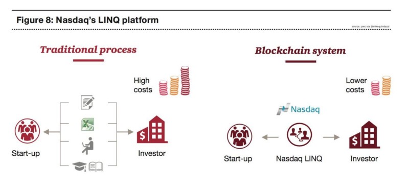

Once an investor has bought an exchange-traded security, before money actually exchanges hands for the security, the transaction needs to clear and settle. In the financial markets,

* **Clearing** refers to the updating of accounts of the involved trading parties and the arranging of the transfer of the securities versus money.
* **Settlement** is the final stage of the securities transaction at which point money is exchanged for security ownership.

This is a long process that involves several parties and intermediaries. That is why the securities clearing and settlement process is poised to be replaced by blockchain-based solutions.

**Using blockchain technology**, the updating of accounts of the two trading parties as well as the transfer of funds in exchange for the security could be conducted in a trustless and immutable manner effectively immediately. This would -

1. Alleviate the need for clearing houses
2. Reduce transactional overheads
3. Increase transaction speeds of securities trades.

An area where blockchain-based securities trading are taking its first roots is in the private securities market.

Example - **Nasdaq** (US Exchange) launched the first blockchain-based trading platform for unlisted securities in 2015 called Linq, stating Linq to be a digital ledger technology based platform that leverages blockchain to facilitate the issuance, cataloging and recording of transfers of shares of privately-held companies on the NASDAQ Private Market.

Artificial Intelligence (AI) also has certain use cases in the trade clearing and settlement process.

Currently, the vast majority of trades are settled through straight-through processing where these trades are executed, confirmed, and settled with little or no involvement by middle office or back-office staff. However, for a number of reasons, trades can fail. Failed trades are rejected and kicked out of the straight-through processing system and into an unconfirmed queue that needs to be settled manually.

Middle-office staff must perform exception processing by identifying the reason for the rejection and fix the trade, a labour intensive process which involves confirming settlement instructions over the phone, communication between the back office and trading desk staff to resolve discrepancies in the financial details of the trade or resolving limit violations. Because of these reasons, the exception processing of rejected trades by middle office and back-office staff comprises of the vast majority of the costs associated with trade settlement.

A.I tech can be used to address the above problem and bring the cost structure down in the following manner -

* **Identify**- AI technologies can analyze vast amounts of historical trading data identifying bad trades and the trades that failed.

* **Analyze**- Once the failed trades have been identified, AI can analyze why the trades were rejected, hence identifying anomalies, gaps, and what's missing in the settlement process. Given the volatility of capital markets, identifying an incorrect trade and remedying the situation sooner, by even a few hours, can amount to significant cost savings.

* **Predict**- After identifying failed trades and spotting the gaps in the process, AI through pattern recognition analysis can predict the likelihood of which trades might fail and propose solutions

As a result, AI can identify failed trades, but also analyse and provide the reason for the fail, allowing a remedy to be implemented. For financial institutions, the expedited remediation of rejected trades can prevent costly consequences such as market losses, negatively impacted clients, and trading limit or regulatory violations.

_"It takes a human five to ten minutes to reconcile a failed trade. A bot can do it in a quarter of a second." - American Banker_

In Summary, the implementation of Blockchain and A.I will greatly optimize the clearing and settlement process which will bring the cost structure down, will provide quicker access to funds through faster settlements (hence will improve liquidity), finance and credit costs will decrease and speed up the detection and rectification of bad trades thereby modernising the securities settlement process.